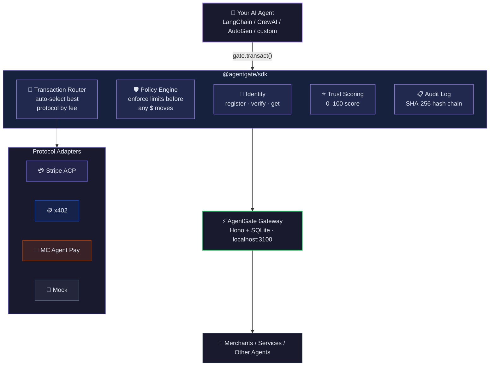

<p align="center">
  
  
  
</p>

# AgentGate

**The interoperability SDK for AI agent transactions.** One integration, every agentic payment rail.

---

## Why

AI agents are starting to spend money — booking flights, purchasing supplies, managing subscriptions — but every payment protocol (Stripe ACP, x402, Mastercard Agent Pay, Google A2A) has its own integration, its own auth flow, and its own merchant format. If you're building an agent that transacts, you're writing four integrations instead of one.

AgentGate is the abstraction layer. Register an agent, set spending policies, and call `gate.transact()`. The SDK auto-routes to the cheapest available protocol, enforces your policies before any money moves, and builds a cryptographic audit trail of every action. Think of it as Plaid for AI agents — except instead of connecting bank accounts, you're connecting payment rails.

Every transaction updates a trust score. Merchants query that score to decide whether to accept an agent. Good agents build reputation. Bad agents get blocked. The trust layer is what turns a convenience library into infrastructure.

## Quickstart

```bash
npm install @agentgate/sdk @agentgate/core
```

```typescript
import { AgentGate } from '@agentgate/sdk';

const gate = new AgentGate({ apiKey: 'test', environment: 'sandbox' });

const agent = await gate.identity.register({
  name: 'shopper-bot',
  capabilities: ['purchase'],
  policies: { maxTransactionAmount: 100, dailySpendLimit: 500 },
});

const result = await gate.transact({
  agentId: agent.id,
  intent: 'purchase',
  preferredProtocol: 'auto',
  item: { description: 'Cold brew', amount: 5.99, currency: 'USD', merchantUrl: 'https://cafe.example.com' },
});

console.log(result.status); // 'completed'
```

No API keys, no merchant setup, no config. Sandbox mode uses a built-in mock adapter — you get a working transaction in 30 seconds.

## Architecture



## Protocols

| Protocol | Status | Description |
|----------|--------|-------------|
| **Stripe ACP** | `Active` | Full Agentic Commerce Protocol — checkout sessions, shared payment tokens, HMAC signing |
| **x402** | `Coming soon` | HTTP 402-based micropayments with stablecoin settlement |
| **Mastercard Agent Pay** | `Coming soon` | Card network payments through Mastercard's agent infrastructure |
| **Google A2A** | `Coming soon` | Agent-to-Agent protocol for multi-agent transaction orchestration |
| **Mock** | `Active` | Built-in sandbox adapter — works offline, no keys needed |

Adding a protocol is one file. Implement the `ProtocolAdapter` interface (`isAvailable`, `supportsIntent`, `estimateFee`, `execute`, `verify`) and call `gate.registerAdapter()`.

## Packages

| Package | Description |
|---------|-------------|
| [`@agentgate/core`](./packages/core) | Shared types, protocol definitions, constants |
| [`@agentgate/sdk`](./packages/sdk) | Client SDK — identity, transactions, trust, policy engine |
| [`apps/gateway`](./apps/gateway) | Hono REST API with SQLite, auth, rate limiting, audit logging |
| [`apps/dashboard`](./apps/dashboard) | Real-time Next.js dashboard — agents, transactions, protocols |
| [`apps/docs`](./apps/docs) | Fumadocs documentation site |
| [`apps/sandbox`](./apps/sandbox) | Demo environment with mock merchants and agent scenarios |

## Installation

```bash
# Clone and install
git clone https://github.com/jacobgadek/agentgate.git
cd agentgate
pnpm install
pnpm build

# Start the gateway
pnpm --filter @agentgate/gateway dev        # → localhost:3100

# Start the dashboard
pnpm --filter @agentgate/dashboard dev      # → localhost:3300

# Start the docs
pnpm --filter @agentgate/docs dev           # → localhost:3200

# Run the sandbox demo
pnpm --filter @agentgate/sandbox dev

# Run examples
pnpm --filter @agentgate/example-simple-purchase start
pnpm --filter @agentgate/example-langchain-shopping-agent start
pnpm --filter @agentgate/example-crewai-booking-agent start
```

## Core Concepts

**Identity** — Every agent gets a unique ID, owner, capabilities list, and spending policies. Register once, transact everywhere.

**Policies** — `maxTransactionAmount`, `dailySpendLimit`, `allowedCategories`, `allowedMerchants`, `blockedMerchants`, `requireHumanApproval`. Enforced before any money moves. No exceptions.

**Trust** — Agents start at 50/100. Successful transactions increase trust (+2). Failures decrease it (-5). Merchants use trust scores to gate access: `new` (0-29) → `established` (30-59) → `trusted` (60-84) → `verified` (85-100).

**Routing** — Set `preferredProtocol: 'auto'` and the SDK picks the cheapest available protocol for each transaction. Or pin a specific protocol when you need to.

**Audit** — Every action (registration, transaction, approval, denial) is logged with a SHA-256 hash chain. Each entry references the previous hash. Tamper-evident by design.

## Examples

| Example | What it shows |
|---------|--------------|
| [`simple-purchase`](./examples/simple-purchase) | Complete transaction in 17 lines |
| [`langchain-shopping-agent`](./examples/langchain-shopping-agent) | LangChain `DynamicTool` integration — search, check trust, buy |
| [`crewai-booking-agent`](./examples/crewai-booking-agent) | Multi-agent crew with least-privilege policies |

## Gateway API

All endpoints require `Authorization: Bearer <api_key>` except health checks.

| Method | Endpoint | Description |
|--------|----------|-------------|
| `GET` | `/v1/health` | Health check |
| `GET` | `/v1/protocols` | List supported protocols |
| `GET` | `/v1/identity` | List all agents |
| `POST` | `/v1/identity/register` | Register a new agent |
| `GET` | `/v1/identity/:agentId` | Get agent details |
| `POST` | `/v1/identity/verify` | Verify agent identity |
| `GET` | `/v1/transact` | List all transactions |
| `POST` | `/v1/transact` | Execute a transaction |
| `GET` | `/v1/transact/:txnId` | Get transaction details |
| `POST` | `/v1/transact/:txnId/approve` | Approve/deny pending transaction |
| `GET` | `/v1/trust/:agentId` | Get trust score |
| `GET` | `/v1/trust/:agentId/report` | Full trust report with audit trail |

## License

MIT
